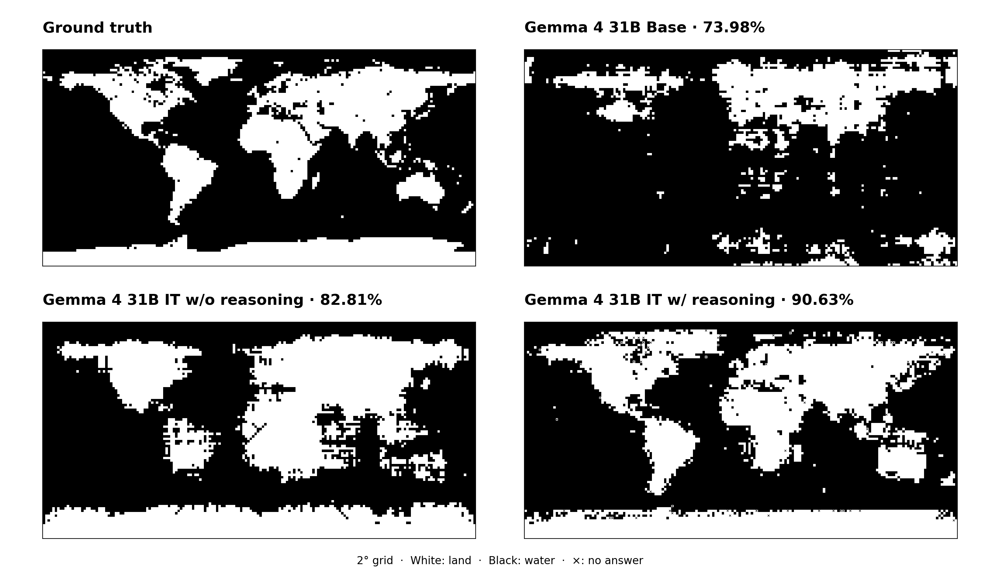

# land-water-eval

A minimal land/water evaluation for language models. Given a latitude and
longitude, the model predicts whether the point is on land or water. The fixed
grid is 90 latitudes (`-89, -87, ..., 89`) by 180 longitudes
(`-179, -177, ..., 179`): 16,200 independent points. The only reported metric
is point accuracy.

<p align="center">
  
</p>

1. pretraining gives the model a basic geo perception. Gemma-4-31B-Base gets ~74% acc.
2. posttraining somehow improves this capacity. Using same prompt as pretrained one, Gemma-4-31B-It gets ~83% acc.
3. enabling reasoning mode (test time scaling) makes the capacity reach the highest ~90% acc. The Gemma model can use relevant geo knowledge to help classify land or water, eg, a position would probably be water if it is located west of California.

It is still unclear why posttraining improves this ability with the same prompt as the pretrained model.

| Panel | Setting | Accuracy |
| --- | --- | ---: |
| Ground truth | GSHHG-derived labels | — |
| Gemma 4 31B Base | direct likelihood readout | 73.98% |
| Gemma 4 31B IT w/o reasoning | native-chat direct likelihood readout | 82.81% |
| Gemma 4 31B IT w/ reasoning | native reasoning and greedy answer | 90.63% |

All maps are raw 90 x 180 predictions (ivory = land, navy = water); no
smoothing or geographic post-processing is applied.

## Protocol

Each point is evaluated once in an independent context. There is no search,
tool use, image input, or few-shot context. Inference uses BF16. The reasoning
condition uses greedy decoding with temperature 0; the two direct conditions
generate zero tokens.

**Gemma 4 31B Base.** `google/gemma-4-31B` receives no chat template:

```text
Latitude: {lat}° {N/S}, Longitude: {lon}° {E/W}.
Question: Is this location land or water?
Answer:
```

At `Answer:`, the evaluator compares the complete continuation likelihoods of
`" Land"` and `" Water"`. The displayed Base map uses a fixed global
margin correction measured from the same prompt with
`Latitude: Unknown, Longitude: Unknown.` in place of the coordinates. The null
margin is measured once per run and subtracted from every grid-point margin;
the published run measured `0.43894386291503906`. No grid labels are used to
set this correction. `Unknown` was selected after comparing
three null placeholders, so this panel is a calibration variant rather than an
untouched Base-model result.

**Gemma 4 31B IT w/o reasoning.** `google/gemma-4-31B-it` receives its native
chat template with thinking disabled and a generation prompt:

```text
Latitude: {lat}° {N/S}, Longitude: {lon}° {E/W}. Classify this location as Land or Water. Answer with exactly one word: Land or Water.
```

No token is generated. At the first assistant position, the evaluator compares
the complete likelihoods of `"Land"` and `"Water"`.

**Gemma 4 31B IT w/ reasoning.** The same IT model uses its native chat template
with thinking enabled:

```text
Latitude: {lat}° {N/S}, Longitude: {lon}° {E/W}. Is this location on land or water? Reason about the geography, then end with exactly "Answer: Land" or "Answer: Water".
```

The evaluator greedily decodes once and parses only the final `Answer: Land`
or `Answer: Water`; an unparseable response is counted wrong. The direct and reasoning settings change
both prompt/readout and whether the model can reason, so their difference is
not a pure estimate of the effect of reasoning alone.

## Reproduce

The repository includes the grid labels and the four-panel figure, but not
model weights, request traces, per-point scores, or runtime logs.

On Linux with CUDA GPUs, install the evaluation dependencies and download the
pinned model snapshots:

```bash
git clone https://github.com/egangu/land-water-eval.git
cd land-water-eval
python -m pip install -r requirements.txt

hf download google/gemma-4-31B \
  --revision 5bbc2fb1c1b2c611d06e3d9f23c170ba21659d89 --local-dir models/base
hf download google/gemma-4-31B-it \
  --revision 842da3794eaa0b77d5f08bae87a17459d91ff475 --local-dir models/it
```

Start an SGLang server for Base (the tensor/data parallelism and hardware are
customizable; the reference runs used four 80 GB H800 GPUs):

```bash
python -m sglang.launch_server --model-path models/base --host 127.0.0.1 --port 30000 \
  --dtype bfloat16 --tp-size 2 --dp-size 2 --mem-fraction-static 0.92 \
  --context-length 9216 --max-running-requests 256 --chunked-prefill-size 8192 \
  --cuda-graph-max-bs 256 --skip-server-warmup

```

Leave the server running and execute this in a second terminal:

```bash
python eval.py --mode base --model models/base --url http://127.0.0.1:30000 --out outputs
```

Restart the server with `--model-path models/it`, then run the two IT
conditions and assemble the figure:

```bash
python eval.py --mode direct reasoning --model models/it --url http://127.0.0.1:30000 --out outputs
python plot.py --results outputs --out outputs/figures
```

`eval.py` writes one raw map per condition and `outputs/summary.json`.
`plot.py` combines those maps with the bundled ground truth. For an immediate
offline reconstruction of the published figure, install only `numpy Pillow matplotlib`
and run `python plot.py`: its
defaults read the bundled compact maps in `results/` and write to `figures/`.

## Ground truth

Labels are sampled directly from the unmodified **GSHHG 2.3.7 intermediate (i)**
shoreline polygons: lakes are `Water`, islands in lakes are `Land`, and locations inside
the Antarctic ice front are `Land`. GSHHG supplies WGS84 geographic coordinates
and hierarchical polygons for land, lakes, and islands in lakes. See the
[NOAA/NCEI shoreline documentation](https://www.ngdc.noaa.gov/mgg/shorelines/shorelines.html)
and its [GSHHG source distribution](https://github.com/GenericMappingTools/gshhg-gmt).

[Download the 2° (16,200-point) and 1° (64,800-point) CSVs](data/README.md).
The published evaluation uses the 2° grid.

## Cite this repository

```bibtex
@misc{egangu2026landwatereval,
  author       = {Egangu},
  title        = {land-water-eval: A Minimal Geographic Evaluation for Language Models},
  year         = {2026},
  howpublished = {GitHub repository},
  url          = {https://github.com/egangu/land-water-eval}
}
```
